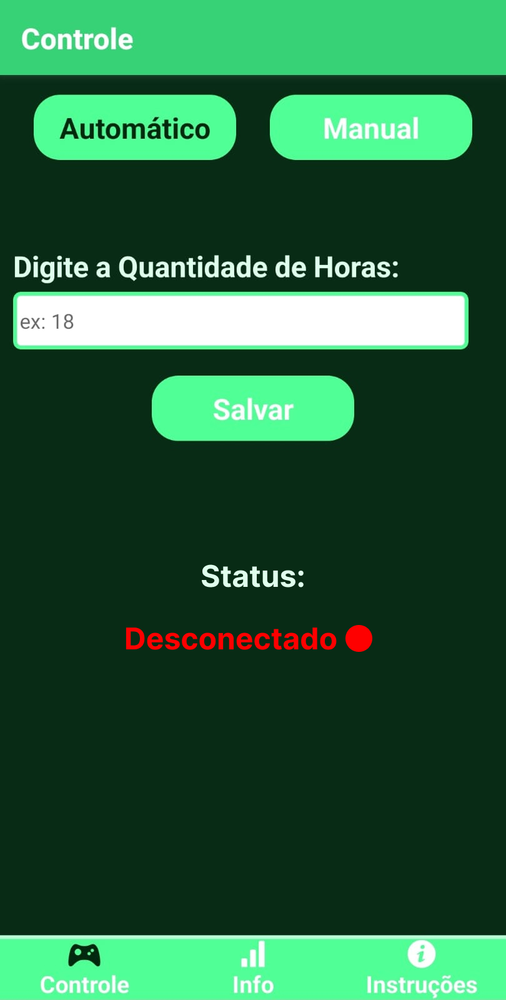
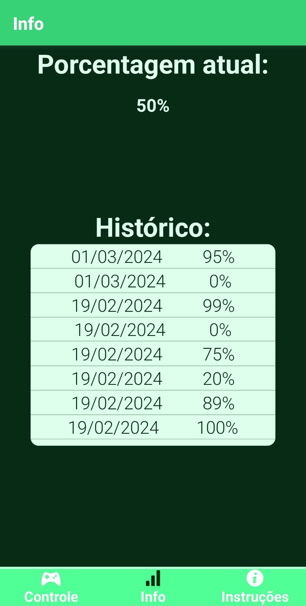
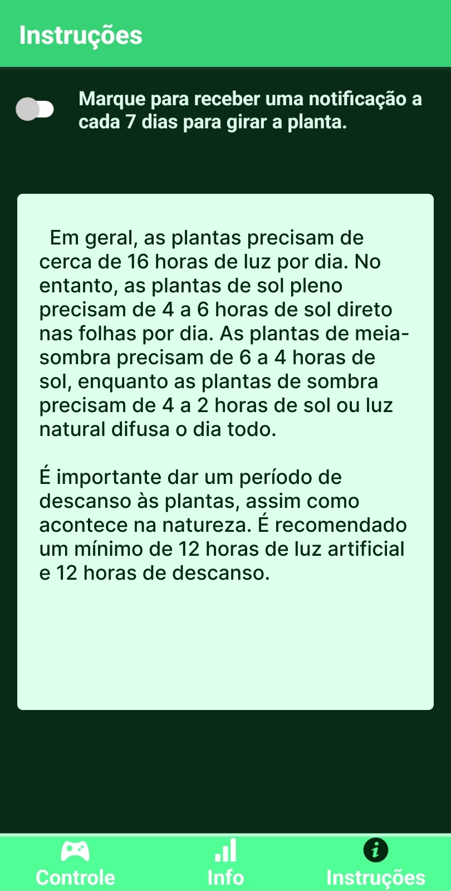

# Ilumina-o-Arduino
Esse foi um aplicativo que eu fiz no início de 2024, onde eu uso um app mobile para controlar um arduino conectado a uma lâmpada específica para o crescimento de plantas.
eu fiz o app usando o framework React Native.

# Funções
    
